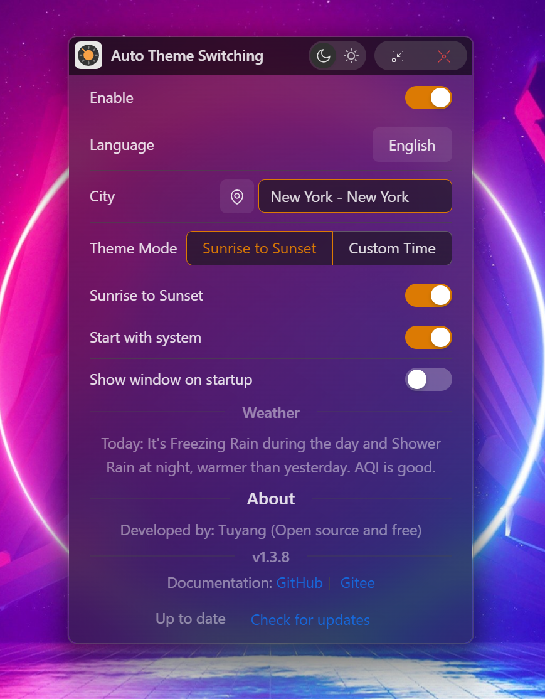

# Windows主题自动切换程序

这是一个简单的Windows主题模式切换工具，可以让你的系统支持日间浅色和夜间深色自动切换。


它由`Rust`构建后端代码，用于执行系统操作。

前端使用：`Typescript`+`Ant Design 5`

日落和日出功能，使用了和风天气免费Api，实现了获取日落和日出数据。
<div align="center">

</div>

## 其它仓库
- Gitee (国内推荐): [https://gitee.com/ilinxuan/windows_-auto-theme](https://gitee.com/ilinxuan/windows_-auto-theme) 
- GitHub: [https://github.com/tuyangJs/Windows_AutoTheme](https://github.com/tuyangJs/Windows_AutoTheme) 

## 调试
安装依赖
```
npm install
```
调试
```
npm start
```
编译
```
npm run tauri build
```
## 如何获取Key
打开和风天气控制台：https://console.qweather.com/#/apps/

注册并登录后根据截图指引操作即可
<div align="center">


</div>


## 联系作者

- QQ群 : [703623743](http://qm.qq.com/cgi-bin/qm/qr?_wv=1027&k=IVNKPTJ9WqoIHHCsy7UMkQd16NLnfjeD&authKey=WVTDqfUgdv9oV0d8%2BZz5krS98IIlB1Kuvm%2BS3pfMU1H6FBCV1b2xoG5pWsggiAgt&noverify=0&group_code=703623743) 
- Email : [ihanlong@qq.com](ihanlong@qq.com) 
